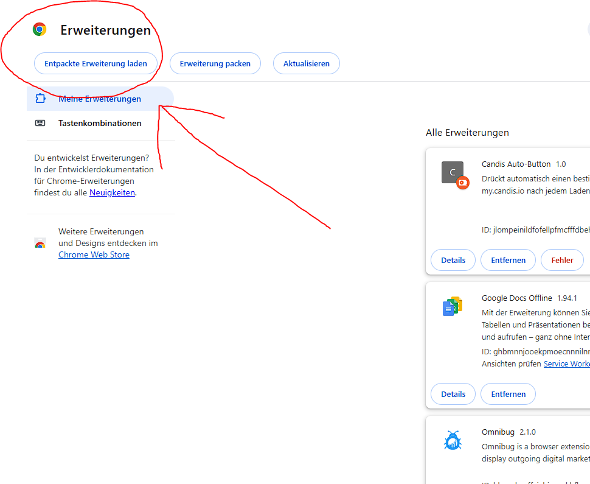

# Candis Auto-Freigeber Chrome Extension

Eine Chrome-Erweiterung, die automatisch Belege auf my.candis.io freigibt.

## 🚀 Features

- **Automatisches Freigeben**: Klickt automatisch den "Freigeben"-Button nach einem einstellbaren Delay
- **Einstellbares Timing**: Delay von 1-60 Sekunden konfigurierbar
- **Live Timer-Anzeige**: Grafischer Countdown im Popup
- **Smart Button Detection**: Findet den Freigeben-Button auch bei DOM-Änderungen
- **SPA-Unterstützung**: Funktioniert mit Single-Page Applications
- **Endlos-Modus**: Arbeitet automatisch alle Belege in der Warteschlange ab
- **Sofort-Stopp**: ESC-Taste stoppt den Autopilot jederzeit

## 📦 Installation

### Schritt 1: Entwicklermodus aktivieren
1. **Öffne Chrome Extensions:** Gehe zu `chrome://extensions/`
2. **Aktiviere den Entwicklermodus:** Schalter oben rechts aktivieren


### Schritt 2: Extension laden
1. **Klicke "Entpackte Erweiterung laden"**
2. **Wähle den Projektordner aus** (candis_freigeber)
3. **Extension wird geladen** und erscheint in der Liste



### Schritt 3: Berechtigung erteilen
- Die Extension benötigt Zugriff auf `my.candis.io`
- Storage-Berechtigung für Einstellungen
- Alle Berechtigungen werden automatisch erteilt

## 🎯 Verwendung

### Grundlegende Bedienung

1. **Navigiere zu einer Candis-Detailseite** mit einem "Freigeben"-Button
2. **Öffne das Extension-Popup** (Icon in der Toolbar)
3. **Stelle das gewünschte Delay ein** (Standard: 3 Sekunden)
4. **Klicke "START"** um den Autopilot zu aktivieren


*Das Popup zeigt "Autopilot ON" (grün) wenn aktiv, "Autopilot OFF" (rot) wenn inaktiv*

### Automatischer Ablauf

1. **Timer startet**: Countdown läuft im Popup (3s → 2s → 1s → Klick!)
2. **Button wird geklickt**: Automatischer Klick auf "Freigeben"
3. **Nächste Seite**: Nach dem Klick lädt automatisch der nächste Beleg
4. **Endlos-Schleife**: Timer startet erneut für den nächsten Beleg

### Stoppen

- **Popup**: Klicke "STOP" im Extension-Popup
- **Tastatur**: Drücke `ESC` auf der Seite
- **Automatisch**: Bei Fehlern oder wenn keine Buttons mehr gefunden werden

## 🎨 UI-Features

### Popup-Anzeige
- **Grüner Button**: "Autopilot ON" - Aktiv
- **Roter Button**: "Autopilot OFF" - Inaktiv
- **Live-Timer**: Zeigt verbleibende Zeit bis zum nächsten Klick
- **Status-Text**: Informiert über aktuellen Zustand
- **Delay-Eingabe**: Einstellbar von 1-60 Sekunden


## 🔧 Technische Details

### Dateien
- `manifest.json`: Extension-Konfiguration (Manifest V3)
- `popup.html/js`: Benutzeroberfläche und Steuerung
- `content.js`: Hauptlogik für automatisches Klicken

### Button-Erkennung
Die Extension sucht nach Buttons mit folgenden Selektoren:
```css
#approval_sidebar > div > div.css-12pf8jm > div > div > div.css-kpdse9 > button:nth-child(1)
#approval_sidebar button
button[type='submit']
button:contains('Freigeben')
button:contains('Approve')
```

## 🐛 Debugging

### Console-Logs aktivieren
Die Extension gibt ausführliche Logs in der Browser-Konsole aus:

**Content Script (Hauptseite):**
```
Candis Content Script geladen auf: https://my.candis.io/...
startAutoClick aufgerufen mit delay: 3
Versuch 1/60 - Root hat Inhalt: true
Button gefunden mit Selector: #approval_sidebar button
Button gefunden, starte 3-Sekunden Timer
Warte auf Freigabe freigeben
```

**Popup Script:**
```
Popup geladen! object Object Object
Timer-Status: {timerActive: true, timerStartTime: 1703123456789, timerDuration: 3}
```

### Häufige Probleme

**Timer läuft nicht:**
- Prüfe, ob Content Script geladen ist (DevTools → Sources → Content Scripts)
- Stelle sicher, dass du auf einer my.candis.io Seite bist

**Button wird nicht gefunden:**
- Öffne DevTools → Console und teste: `document.querySelector("#approval_sidebar button")`
- Prüfe, ob der Button wirklich auf der Seite existiert

**Extension lädt nicht:**
- Gehe zu chrome://extensions/ und klicke "Aktualisieren"
- Prüfe auf Fehler in der Extension-Konsole

## 📄 Lizenz

Dieses Projekt ist für den internen Gebrauch bei TMG entwickelt.

## 🤝 Entwicklung

### Lokale Entwicklung
1. Änderungen an den Dateien vornehmen
2. Extension in chrome://extensions/ aktualisieren
3. Seite neu laden und testen